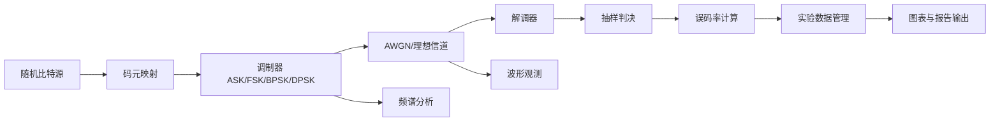
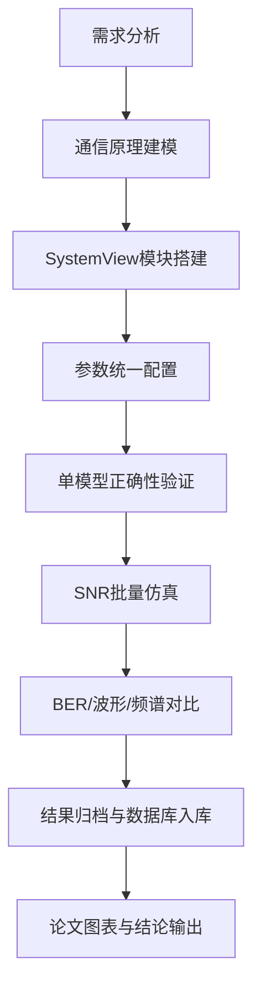
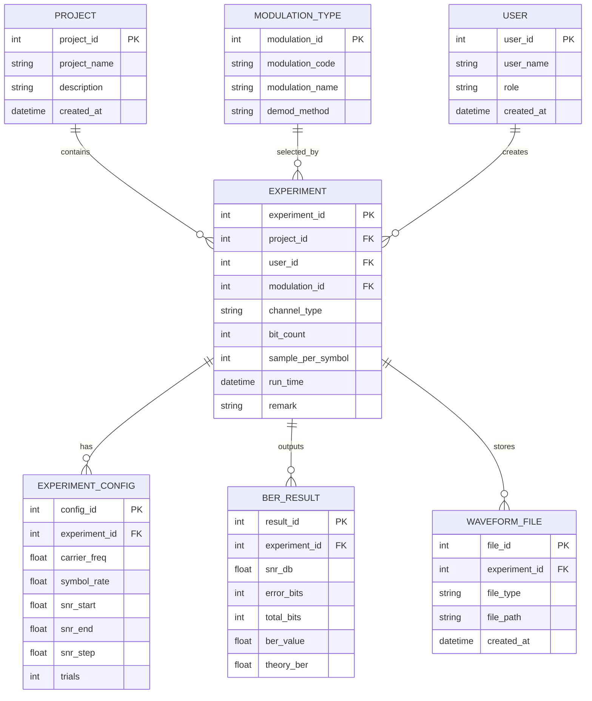

# 基于 SystemView 的数字频带通信系统仿真与分析（论文初稿）

## 摘要

数字频带调制技术是现代数字通信系统中的核心环节，其性能直接影响系统在噪声信道下的可靠性与传输质量。本文围绕 `ASK`、`FSK`、`BPSK` 与 `DPSK` 四种典型数字频带调制方式，完成了基于 `SystemView` 的系统建模与仿真分析，并构建了配套的数据管理与可视化工具用于实验结果整理和对比。研究采用“理论分析 + 仿真实验 + 指标对比”的技术路线，在统一参数条件下对四种调制方式进行误码率、波形恢复和抗干扰能力评估。结果表明，在 `AWGN` 信道环境下，不同调制方式在误码性能和实现复杂度方面存在明显差异，`BPSK` 在误码率方面整体较优，`DPSK` 具有较好的工程可实现性，`FSK` 在一定场景下具有稳定的抗干扰能力，`ASK` 结构简单但对噪声相对敏感。本文工作可为数字频带通信系统教学实验与工程方案选型提供参考。

关键词：SystemView；数字频带通信；ASK；FSK；BPSK；DPSK；误码率

---

## 第1章 绪论

### 1.1 研究背景与意义

随着信息通信技术的快速发展，数字通信系统在无线通信、卫星通信、物联网和工业控制等领域得到广泛应用。数字频带调制作为基带信息映射到传输信道的关键过程，直接决定了系统的传输效率、抗噪声能力以及硬件实现复杂度。对不同调制方式进行建模与对比分析，是通信原理课程与工程实践中的重要内容。

在毕业设计教学场景中，基于仿真平台开展实验具有成本低、可重复、参数可控等优势。`SystemView` 作为通信系统仿真工具，可快速完成发送端、信道和接收端的模块化搭建，适合用于数字频带调制的教学研究。通过对 `ASK`、`FSK`、`BPSK` 与 `DPSK` 的系统级仿真，可以直观分析各调制方式在不同信噪比条件下的性能差异，并形成可用于论文与答辩的完整实验证据链。

### 1.2 研究目标

本文主要目标如下：

1. 构建基于 `SystemView` 的数字频带通信仿真系统。
2. 实现 `ASK`、`FSK`、`BPSK`、`DPSK` 四种调制解调链路。
3. 在统一参数与信道条件下完成性能对比实验。
4. 建立仿真数据管理结构，支持结果归档、图表输出与论文分析。

### 1.3 研究内容与章节安排

本文从系统原理、总体设计、仿真实现、数据库设计和结果分析五个层面展开。后续章节依次介绍数字频带调制理论、系统架构与流程、关键模块实现、实验设计与结果分析，最后给出总结与展望。

---

## 第2章 数字频带调制理论基础

### 2.1 数字频带通信系统基本模型

数字频带通信系统由发送端、信道、接收端和性能评估模块构成。发送端完成比特映射与载波调制，信道叠加噪声和干扰，接收端完成同步、解调与判决，最终通过误码率等指标评估系统性能。

### 2.2 ASK 调制原理

`ASK`（Amplitude Shift Keying）通过改变载波幅度表示数字信息。其优点是实现简单、硬件开销低，缺点是对幅度噪声和衰落较敏感。在接收端可采用包络检波或相干解调方式恢复信号。

### 2.3 FSK 调制原理

`FSK`（Frequency Shift Keying）通过切换不同载波频率表示比特。二进制 `FSK` 常采用 `f0`、`f1` 对应比特 `0`、`1`。相比 `ASK`，`FSK` 对幅度扰动更不敏感，抗干扰能力一般更优。

### 2.4 BPSK 调制原理

`BPSK`（Binary Phase Shift Keying）通过载波相位翻转传递信息，通常将比特映射为 `+1/-1`，其误码性能在经典二进制调制中较好，但需要较稳定的相干解调条件。

### 2.5 DPSK 调制原理

`DPSK`（Differential Phase Shift Keying）通过相邻码元相位差编码，降低了对绝对相位同步的依赖，工程上更易实现。其性能通常略低于理想相干 `BPSK`，但综合实现代价较低。

---

## 第3章 系统总体设计与技术路线

### 3.1 总体设计思路

本课题采用“统一参数、分模块建模、分场景测试、统一指标评估”的思路。为保证结果可比性，四种调制方式共享核心实验参数（比特数、采样率、信噪比扫描范围），仅替换调制与解调模块。

### 3.2 系统整体体系结构

### 3.3 技术路线流程图

### 3.4 功能模块划分

1. 仿真建模模块：完成四种调制方式链路搭建。
2. 信道与噪声模块：提供理想信道与 `AWGN` 场景。
3. 性能评估模块：输出 BER、波形、频谱等指标。
4. 数据管理模块：保存实验配置、曲线数据、结论文本。

### 3.5 关键参数设计

建议参数基线如下：

1. 码元速率：`1 kbps`
2. 采样频率：`100 kHz`
3. 载波频率：`10 kHz`
4. 仿真比特数：`1000~5000`
5. SNR 范围：`0~20 dB`（步长 `2 dB`）
6. FSK 频率：`f0=8 kHz`，`f1=12 kHz`

---

## 第4章 系统详细设计与实现

### 4.1 发送端设计

发送端由随机比特源、码元映射器和调制器组成。比特源产生二进制序列后，按对应调制方式映射为基带驱动信号，再与载波作用生成已调信号。

### 4.2 信道模型设计

信道采用两类模型：

1. 理想信道：验证模型逻辑正确性。
2. `AWGN` 信道：评估抗噪声性能。

### 4.3 接收端设计

接收端按调制方式选择对应解调链路：

1. ASK：包络或相干解调 + 判决。
2. FSK：双路相关/滤波判决。
3. BPSK：相干乘积解调 + 低通 + 判决。
4. DPSK：延时差分检测 + 判决。

### 4.4 仿真实现说明

本课题仿真主线以 `SystemView` 模型为核心，配套实现了本地可视化仿真页面（`simulator/index.html`）用于参数扫描、结果导出与报告生成。该配套工具不替代 `SystemView`，主要用于：

1. 快速批量跑 SNR-BER 曲线。
2. 输出 CSV 便于论文作图。
3. 统一实验记录格式，减少手工整理误差。

---

## 第5章 数据库设计（实验管理子系统）

> 说明：传统通信仿真本身不强制依赖数据库，但为满足实验过程管理、结果可追溯和论文规范化需求，本文设计轻量数据库用于保存实验配置与结果记录。

### 5.1 数据库设计目标

1. 管理实验项目与实验批次。
2. 保存参数配置和调制方式信息。
3. 保存每个 SNR 点的 BER 结果与统计数据。
4. 支持导出图表与报告追溯。

### 5.2 ER 图

### 5.3 数据库表结构设计

#### 5.3.1 `project`（项目表）

| 字段名 | 类型 | 约束 | 说明 |
|---|---|---|---|
| project_id | INT | PK, AUTO_INCREMENT | 项目主键 |
| project_name | VARCHAR(100) | NOT NULL | 项目名称 |
| description | TEXT | NULL | 项目描述 |
| created_at | DATETIME | NOT NULL | 创建时间 |

#### 5.3.2 `modulation_type`（调制方式字典表）

| 字段名 | 类型 | 约束 | 说明 |
|---|---|---|---|
| modulation_id | INT | PK, AUTO_INCREMENT | 主键 |
| modulation_code | VARCHAR(20) | UNIQUE, NOT NULL | `ASK/FSK/BPSK/DPSK` |
| modulation_name | VARCHAR(50) | NOT NULL | 名称 |
| demod_method | VARCHAR(100) | NULL | 解调方法 |

#### 5.3.3 `experiment`（实验主表）

| 字段名 | 类型 | 约束 | 说明 |
|---|---|---|---|
| experiment_id | INT | PK, AUTO_INCREMENT | 主键 |
| project_id | INT | FK | 所属项目 |
| user_id | INT | FK | 执行人 |
| modulation_id | INT | FK | 调制方式 |
| channel_type | VARCHAR(20) | NOT NULL | `ideal`/`awgn` |
| bit_count | INT | NOT NULL | 比特数 |
| sample_per_symbol | INT | NOT NULL | 每码元采样点 |
| run_time | DATETIME | NOT NULL | 运行时间 |
| remark | VARCHAR(255) | NULL | 备注 |

#### 5.3.4 `experiment_config`（实验参数表）

| 字段名 | 类型 | 约束 | 说明 |
|---|---|---|---|
| config_id | INT | PK, AUTO_INCREMENT | 主键 |
| experiment_id | INT | FK, UNIQUE | 对应实验 |
| carrier_freq | FLOAT | NOT NULL | 载波频率 |
| symbol_rate | FLOAT | NOT NULL | 码元速率 |
| snr_start | FLOAT | NOT NULL | 扫描起点 |
| snr_end | FLOAT | NOT NULL | 扫描终点 |
| snr_step | FLOAT | NOT NULL | 扫描步长 |
| trials | INT | NOT NULL | 重复次数 |

#### 5.3.5 `ber_result`（BER 结果表）

| 字段名 | 类型 | 约束 | 说明 |
|---|---|---|---|
| result_id | INT | PK, AUTO_INCREMENT | 主键 |
| experiment_id | INT | FK | 所属实验 |
| snr_db | FLOAT | NOT NULL | SNR 点 |
| error_bits | INT | NOT NULL | 错误比特数 |
| total_bits | INT | NOT NULL | 总比特数 |
| ber_value | FLOAT | NOT NULL | 仿真 BER |
| theory_ber | FLOAT | NULL | 理论 BER |

#### 5.3.6 `waveform_file`（波形文件索引表）

| 字段名 | 类型 | 约束 | 说明 |
|---|---|---|---|
| file_id | INT | PK, AUTO_INCREMENT | 主键 |
| experiment_id | INT | FK | 所属实验 |
| file_type | VARCHAR(30) | NOT NULL | tx/rx/spectrum/report |
| file_path | VARCHAR(255) | NOT NULL | 文件路径 |
| created_at | DATETIME | NOT NULL | 创建时间 |

---

## 第6章 实验方案与结果分析

### 6.1 实验方案

实验按“正确性验证 + 性能扫描 + 对比分析”三步进行：

1. 无噪声条件验证：确保四种链路可正确恢复比特流。
2. `AWGN` 条件扫频：统计不同 SNR 下 BER 变化。
3. 横向对比分析：综合误码性能、实现复杂度和同步要求给出结论。

### 6.2 指标定义

1. 误码率：
   \[
   BER = \frac{N_e}{N}
   \]
   其中 \(N_e\) 为误码数，\(N\) 为总比特数。

2. 抗干扰能力：在同一 BER 阈值下，所需 SNR 越低则抗干扰能力越强。

3. 恢复质量：通过解调后波形与原始比特对应关系进行观察。

### 6.3 典型结果讨论（论文撰写模板）

1. 在低 SNR 区域，四种调制方式 BER 均较高，随 SNR 提升明显下降。
2. `BPSK` 曲线整体位于较低 BER 区域，误码性能较优。
3. `DPSK` 在不依赖严格绝对相位同步的前提下保持较好性能。
4. `FSK` 在一定噪声条件下较 `ASK` 更稳定。
5. `ASK` 由于幅度敏感性，在低信噪比时性能下降较快。

### 6.4 结果可视化与论文图表建议

1. 图 3-1：系统总体结构图。
2. 图 3-2：实验技术路线流程图。
3. 图 4-1~4-4：四种调制系统模块图。
4. 图 5-1：ER 图。
5. 图 6-1：四种调制 BER 对比曲线。
6. 表 6-1：统一参数配置表。
7. 表 6-2：不同 SNR 条件 BER 统计表。

---

## 第7章 总结与展望

### 7.1 工作总结

本文围绕“基于 `SystemView` 的数字频带通信系统仿真与分析”完成了从理论建模到系统实现、从实验设计到结果分析的完整流程。通过 `ASK`、`FSK`、`BPSK`、`DPSK` 四种调制方式对比，验证了各方法在不同信噪比下的性能差异，并提出了适用于实验管理的数据结构与数据库设计方案。整体工作满足了毕业设计对系统性、可实现性和可分析性的要求。

### 7.2 不足与改进方向

1. 当前信道模型以 `AWGN` 为主，后续可扩展瑞利衰落、多径等复杂场景。
2. 当前结果分析以 BER 为主，后续可补充频谱效率、峰均功率比等指标。
3. 可进一步与 SDR 硬件平台结合，形成“仿真+实测”闭环验证。

---

## 参考文献（示例）

1. 樊昌信, 曹丽娜. 《通信原理》. 国防工业出版社.
2. Proakis J G, Salehi M. *Digital Communications*. McGraw-Hill.
3. Sklar B. *Digital Communications: Fundamentals and Applications*. Prentice Hall.
4. 刘树棠. 《数字通信系统仿真》. 电子工业出版社.

---

## 附录A：数据库建表 SQL

附录 SQL 见文件：[database_schema.sql](C:\Users\ASUS2308\Desktop\毕设\docs\database_schema.sql)

## 附录B：配套文件清单

1. 仿真器入口：[index.html](C:\Users\ASUS2308\Desktop\毕设\simulator\index.html)
2. 仿真核心：[app.js](C:\Users\ASUS2308\Desktop\毕设\simulator\app.js)
3. 参数表：[参数配置表.csv](C:\Users\ASUS2308\Desktop\毕设\data\参数配置表.csv)
4. 结果模板：[实验结果记录模板.csv](C:\Users\ASUS2308\Desktop\毕设\data\实验结果记录模板.csv)
