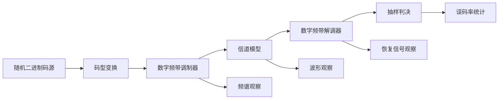

# 数字频带通信系统总体设计

## 1. 设计目标

根据任务书要求，本系统的设计目标如下：

1. 在 `System View` 平台上建立完整的数字频带通信仿真系统。
2. 分别实现 `ASK`、`FSK`、`PSK`、`DPSK` 四种数字频带调制方式的发送与接收模型。
3. 在不同信道条件下分析各调制方式的传输性能和抗干扰能力。
4. 输出便于论文使用的波形、频谱、误码率和对比分析结果。

## 2. 总体架构

系统总体采用“发送端 + 信道 + 接收端 + 性能评估”的典型结构。

## 3. 系统组成

### 3.1 发送端

发送端主要完成比特序列产生、基带成形和数字频带调制。其核心功能包括：

1. 产生随机二进制序列作为原始信息。
2. 将二进制码映射为适合调制的基带信号。
3. 与载波结合，形成对应的已调频带信号。

### 3.2 信道

信道部分用于模拟实际传输环境。为了与毕业设计难度和任务书要求保持一致，建议至少完成以下两类信道：

1. 理想信道
   用于观察系统在无噪声条件下的正常收发过程。
2. `AWGN` 信道
   用于研究噪声影响以及不同调制方式的抗干扰能力。

如果时间充足，可进一步扩展：

1. 衰落信道
2. 多径信道

### 3.3 接收端

接收端用于完成已调信号恢复，主要流程包括：

1. 滤波或同步处理。
2. 相干或非相干解调。
3. 低通滤波与抽样判决。
4. 恢复原始数字序列。

### 3.4 性能评估模块

系统应至少完成以下指标分析：

1. 输出波形是否正确恢复。
2. 已调信号频谱特性。
3. 不同信噪比下的误码率。
4. 不同调制方式的抗噪声能力比较。

## 4. 调制方式设计

### 4.1 ASK

`ASK` 通过改变载波幅度表示数字信息。实现简单，但对噪声敏感，抗干扰能力较弱。

建议模型特征：

1. 二进制 `1` 对应高幅度载波。
2. 二进制 `0` 对应低幅度或无载波。
3. 接收端可采用包络检波或相干解调。

### 4.2 FSK

`FSK` 通过切换不同载波频率表示数字信息，相比 `ASK` 抗干扰能力更强。

建议模型特征：

1. 二进制 `1` 对应频率 `f1`。
2. 二进制 `0` 对应频率 `f2`。
3. 接收端可采用双路带通滤波加包络判决，或相关解调。

### 4.3 PSK

`PSK` 通过载波相位变化表示数字信息。若选用二进制相移键控，即 `BPSK`，其结构清晰、性能较好，适合作为毕设主分析对象之一。

建议模型特征：

1. 二进制 `1` 映射为 `+1`。
2. 二进制 `0` 映射为 `-1`。
3. 与同一载波相乘形成反相或同相输出。
4. 接收端采用相干解调和门限判决。

### 4.4 DPSK

`DPSK` 在发射端加入差分编码，通过相邻码元相位变化传递信息，避免严格绝对相位同步的要求。

建议模型特征：

1. 发射前先做差分编码。
2. 采用相位翻转完成频带调制。
3. 接收端可采用延时比较或差分检测。

## 5. 建议的统一参数基线

为了便于比较不同调制方式，建议四种系统共用同一组基础参数：

1. 码元速率：`1 kbps`
2. 码元周期：`1 ms`
3. 采样频率：`100 kHz`
4. 载波频率：`10 kHz`
5. 仿真比特数：`1000`
6. 信噪比扫描范围：`0 dB` 到 `20 dB`
7. 步长：`2 dB`

对于 `FSK`，建议额外设置：

1. `f1 = 12 kHz`
2. `f2 = 8 kHz`

## 6. 核心对比指标

### 6.1 误码率

误码率是本课题最核心的性能指标，用于衡量各调制方式在噪声干扰下的信息恢复能力。

### 6.2 波形恢复情况

主要观察：

1. 发射端基带波形。
2. 已调波形。
3. 信道输出波形。
4. 解调恢复波形。

### 6.3 频谱特性

通过频谱分析观察不同调制方式的带宽占用和频域分布特点。

### 6.4 抗干扰能力

通过误码率曲线和波形失真程度综合比较 `ASK`、`FSK`、`PSK`、`DPSK` 在不同信噪比条件下的稳定性。

## 7. 预期结论方向

基于通信原理，一般可得到如下结论方向，后续仿真结果需围绕这些方面展开验证：

1. `ASK` 结构最简单，但抗噪声能力相对较弱。
2. `FSK` 在一定条件下具有较好的抗干扰性能。
3. `PSK` 尤其是 `BPSK` 通常具有较优的误码性能。
4. `DPSK` 在降低同步要求的同时，性能通常略低于理想相干 `PSK`，但工程实现更方便。

## 8. 对论文写作的支撑作用

本系统总体设计可直接支撑论文以下章节：

1. 系统总体方案设计
2. 各种数字频带调制原理分析
3. 仿真模型构建过程
4. 参数配置与实验设计
5. 仿真结果与性能比较分析
